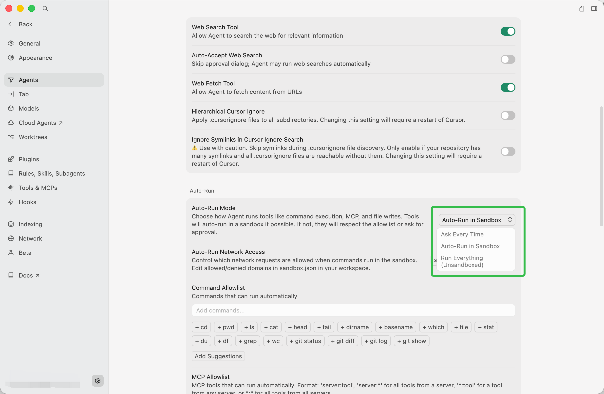

# CALL-E Troubleshooting

Use this guide when CALL-E installation, authentication, or tool verification
fails in a local agent environment.

## Cursor agent shell returns `CONNECT tunnel failed, response 403`

### Symptoms

In Cursor, CALL-E setup may fail even though the local machine has normal network
access. Common symptoms include:

- `npx skills add https://github.com/CALLE-AI/call-e-integrations --skill calle`
  fails because sandboxed Git cannot write hooks.
- `calle auth login` fails with a generic `fetch failed` error.
- A direct network check fails with:

  ```text
  curl: (56) CONNECT tunnel failed, response 403
  ```

- The agent environment reports limited or allowlist-only network access.

### Cause

The `403` is returned by Cursor's sandbox network gate before the request reaches
CALL-E. It is not a CALL-E authentication failure and does not mean the CALL-E
server rejected the user.

The sandboxed agent shell may block outbound HTTPS connections to
`https://seleven-mcp-sg.airudder.com`, which prevents the CLI from starting the
brokered OAuth flow.

### Fix

Change the local Cursor agent execution mode so commands are not running in the
restricted sandbox:

1. Open Cursor Settings.
2. Go to **Agents**.
3. In **Auto-Run**, open **Auto-Run Mode**.
4. Select **Run Everything (Unsandboxed)**.

After switching to a non-sandboxed mode, retry the CALL-E login or setup check.

### Cursor Setting Screenshot



### Verify

Run these commands outside the restricted sandbox:

```bash
calle auth login
calle auth status --json
calle mcp tools
```

Confirm that authentication is usable and that the tool list includes:

```text
plan_call
run_call
get_call_run
```

If the same URL works from the user's terminal but fails only inside the Cursor
agent shell, the issue is the Cursor sandbox policy rather than CALL-E service
availability.
