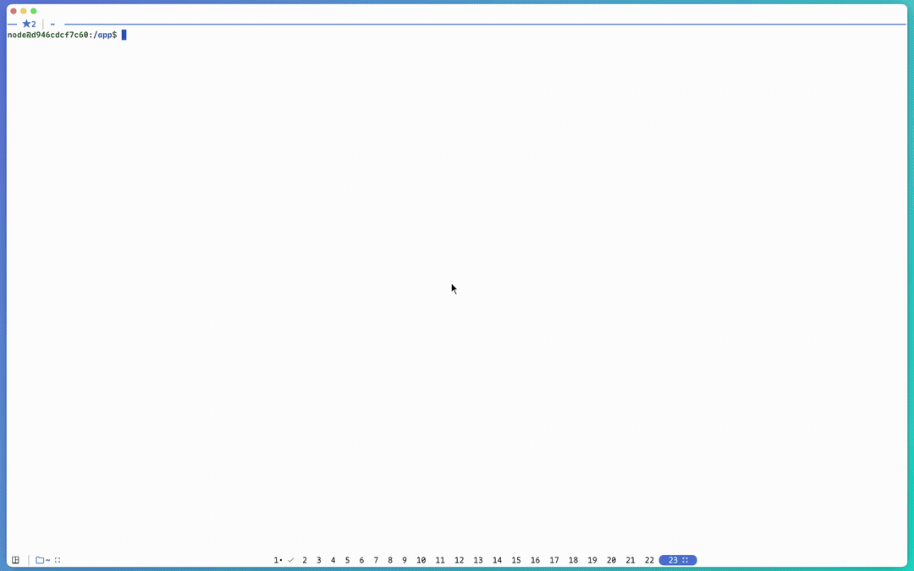
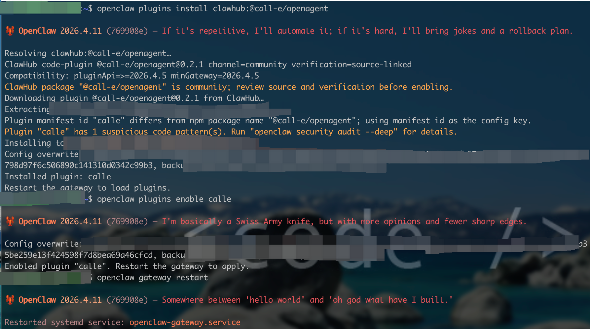
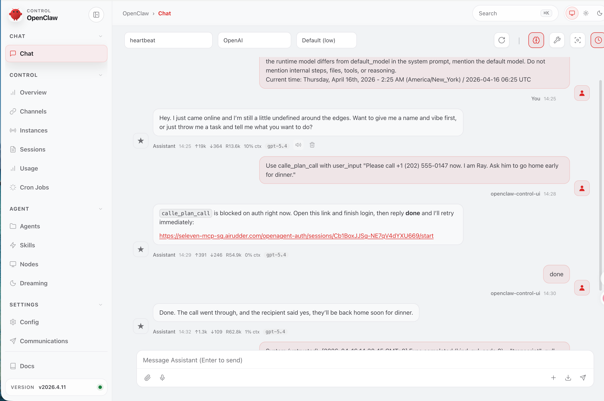

# `@call-e/openagent`

`@call-e/openagent` is a self-contained OpenClaw plugin for brokered web login and remote OpenAgent MCP tool execution.

## Demo

Install, enable, and restart walkthrough in the terminal:



It registers three OpenClaw-native tools:

- `calle_plan_call`
- `calle_run_call`
- `calle_get_call_run`

The package contains the full runtime needed to:

- create and reconcile brokered authentication sessions
- persist `token.json` and `pending_login.json`
- exchange authorized broker sessions into a local token cache
- call remote MCP tools over streamable HTTP

## Community

Join the Discord community for installation help, rollout updates, and feedback:

- [discord.gg/6AbXUzUV8w](https://discord.gg/6AbXUzUV8w)

## Installation

On the machine that runs `openclaw-gateway`, the quickest path is:

```bash
curl -fsSL https://raw.githubusercontent.com/CALLE-AI/call-e-integrations/main/openclaw-setup.sh | bash
```

If you already cloned this repository on that machine, you can run:

```bash
./openclaw-setup.sh
```

That script installs the published package, enables `calle`, merges
`plugins.entries.calle.enabled` and `plugins.allow` into
`~/.openclaw/openclaw.json`, and asks before restarting the gateway.
It depends on `openclaw` and `node`, not Python.

If you prefer the manual path, run:

```bash
openclaw plugins install @call-e/openagent
openclaw plugins enable calle
openclaw gateway restart
```

## Install Walkthrough

Static terminal screenshot:



## OpenClaw UI Chat

Example OpenClaw Control UI chat session with the plugin:



## Default Target

With no explicit plugin configuration, the plugin targets:

- `baseUrl = https://seleven-mcp-sg.airudder.com`
- `serverUrl = https://seleven-mcp-sg.airudder.com/mcp/openagent_auth`

## Configuration

A minimal `openclaw.json` override looks like this:

```json
{
  "plugins": {
    "entries": {
      "calle": {
        "enabled": true,
        "config": {
          "baseUrl": "https://your-domain"
        }
      }
    }
  }
}
```

The plugin derives the following values from `baseUrl` unless they are explicitly overridden:

- `serverUrl`
- `brokerBaseUrl`
- `authBaseUrl`
- `channel`
- `cacheRoot`
- `scope`
- `clientName`
- `timeoutSeconds`
- `minTtlSeconds`

## Troubleshooting

For installation failures, brokered login issues, and token-cache reset steps, see
[docs/troubleshooting.md](./docs/troubleshooting.md).

## Remote Service Requirements

The remote deployment must expose:

- `POST /api/v1/openagent-auth/sessions`
- `GET /api/v1/openagent-auth/sessions/{session_id}`
- `POST /api/v1/openagent-auth/sessions/{session_id}/exchange`
- `GET /openagent-auth/sessions/{session_id}/start`
- `GET /openagent-auth/callback`
- a protected MCP endpoint, typically `/mcp/openagent_auth`

See the [OpenClaw service contract](https://github.com/CALLE-AI/call-e-integrations/blob/main/docs/openclaw-service-contract.md) for the full remote deployment contract.

## Development

Run the package tests from the repository root:

```bash
pnpm --filter @call-e/openagent test
pnpm --filter @call-e/openagent check
pnpm --filter @call-e/openagent pack:dry-run
```
