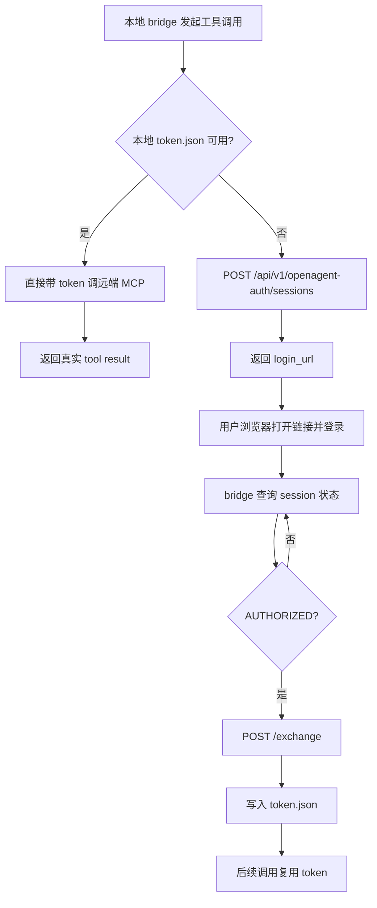
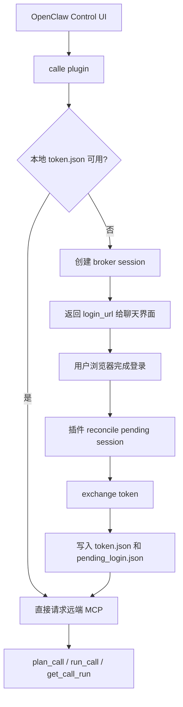

# Broker、Bridge 到 Self-contained Plugin：`@call-e/openagent` 的 OpenClaw 集成复盘

这篇文章记录 `@call-e/openagent` 在 OpenClaw 上线过程中，围绕 broker 登录、bridge 调试链路、插件化落地、以及最终收敛为 self-contained plugin 的完整过程。

目标不是展示一份“最终方案说明书”，而是把几个真正影响成败的问题讲清楚：

- 为什么最开始不能直接靠 MCP server 配置完成集成
- 为什么要先做 broker + bridge
- Python bridge 方案解决了什么，又卡在了哪里
- 为什么最后必须把逻辑迁进插件本身
- 这套方案在工程上有哪些关键边界和经验

## 1. 背景与目标

我们需要把远端 OpenAgent MCP 能力接入 OpenClaw，让用户可以在 OpenClaw 的正常聊天界面里直接使用以下能力：

- `calle_plan_call`
- `calle_run_call`
- `calle_get_call_run`

同时，这套能力必须支持浏览器登录。

具体要求是：

1. 用户第一次调用受保护工具时，直接在聊天里拿到登录链接。
2. 用户在浏览器完成登录。
3. 回到 OpenClaw 后继续调用，不需要再做额外的 CLI 操作。
4. 后续调用能复用本地 token cache。

这看起来像一个“给 OpenClaw 配个 MCP server”的问题，但实际并不是。

## 2. 第一阶段：直接把远端 MCP 配到 OpenClaw

最开始的尝试很直接：把远端 MCP server 写进 OpenClaw 的 `mcp.servers`，希望它能出现在聊天会话的 `Tools -> Available Right Now` 里，然后由模型直接调工具。

这条路的问题很快暴露出来：

- `mcp.servers` 只是保存了 server 定义，不等于当前 Control UI 聊天会话一定会加载这个 MCP。
- 在默认聊天 surface 下，工具是否可用看的是运行时实际加载结果，而不是配置文件里有没有写。
- 结果就是：MCP 定义虽然已经保存，聊天里却仍然调不到对应工具。

这意味着：

- 远端 MCP 服务本身是通的
- OpenClaw 也能保存这条 MCP 配置
- 但“在普通聊天界面直接触发它”这件事，并没有因为配置写进去就自动成立

这是第一次关键转折：**问题不是单纯的 MCP 协议问题，而是 OpenClaw 运行时如何消费工具的问题。**

## 3. 第二阶段：引入 Broker + Python Bridge

既然普通聊天界面无法稳定消费远端 MCP 配置，下一步就要解决两个更具体的问题：

1. 如何把浏览器登录这一步引入到工具调用里
2. 如何在 OpenClaw 外先把整个登录链路验证通

于是引入了两层：

- broker：负责创建浏览器登录 session、查询状态、exchange token
- local bridge：负责在本地发起工具调用、感知认证需求、生成登录链接、落 token cache

当时的核心 Python 文件是：

- `openclaw_brokered_auth.py`
- `openclaw_brokered_mcp_bridge.py`

这套方案的价值不在于最终交付形态，而在于它给了我们一个非常强的调试入口：

- 可以在不依赖 OpenClaw UI 的前提下，先独立验证 broker 登录链路
- 可以直接验证 token 是否写入本地
- 可以精确验证远端 MCP 的 `plan_call` / `run_call` / `get_call_run`

也就是说，**Python bridge 是调试基础设施，不是最终产品形态。**

## 4. Broker + Bridge 的工作方式

这一阶段的逻辑可以抽象成下面这张图：



这里的本地状态文件有两个：

- `token.json`
- `pending_login.json`

它们默认放在：

```text
~/.calle-mcp/openclaw-brokered-auth/<server_hash>/
```

这是后面插件实现仍然保留的设计，因为这套文件布局已经被验证过。

## 5. Python Bridge 方案解决了什么

这套方案实际解决了几个非常重要的问题：

### 5.1 把认证问题和 OpenClaw UI 问题拆开了

一开始最大的问题是“OpenClaw 聊天里调不到工具”，这会让所有问题混在一起。

有了 bridge 之后，我们就能明确区分：

- 认证链路是否正常
- 远端 MCP 是否正常
- OpenClaw UI/runtime 是否真正调用到了工具

这一步极大降低了定位复杂度。

### 5.2 先把真正困难的 broker 流程跑通了

浏览器登录不是普通 HTTP bearer token 那种模式，它有明显的异步状态：

- session 创建
- 浏览器跳转
- 用户完成登录
- broker 状态从 `PENDING` 变成 `AUTHORIZED`
- exchange 成本地 token

这条链路只要有一个环节没打通，OpenClaw 里就不可能顺利工作。

bridge 的存在让我们先把这一条链路彻底打透。

### 5.3 提供了 shell 级调试能力

像下面这种命令，在调试期非常重要：

```bash
uv run --with mcp --with httpx python3 openclaw_brokered_mcp_bridge.py tool-call \
  --base-url https://your-domain \
  --channel chatgpt_oauth \
  --tool-name plan_call \
  --tool-arguments-json '{"user_input":"Please call +14155550100 tomorrow afternoon."}'
```

它让我们可以在没有 OpenClaw UI 参与的情况下，单独观察：

- 是不是要求登录
- 返回的 `login_url` 对不对
- token 有没有真正写入磁盘
- 远端工具是不是能执行

## 6. Python Bridge 方案暴露出来的问题

这套方案虽然把链路跑通了，但它不适合作为最终交付物，原因主要有四类。

### 6.1 OpenClaw 普通聊天界面并不会直接消费它

Python bridge 最初仍然是围绕 MCP server 接入设计的。

但前面已经证明，默认聊天 surface 并不会因为 `mcp.servers` 写好了，就自动让工具出现在 `Available Right Now`。

所以 bridge 方案虽然能在 shell 里调通，却不能自动变成用户最终会话里的工具。

### 6.2 交付依赖太重

当时的 plugin 只是一个壳，运行时依赖：

- `uv`
- `python3`
- `openclaw_brokered_auth.py`
- `openclaw_brokered_mcp_bridge.py`

这带来几个问题：

- 服务器必须先具备 Python/uv 环境
- 还要把额外脚本传上去
- 插件本身不是自包含的
- 发布 npm 包后，别人装完也不能直接运行

这在内部调试时可以接受，但不适合作为标准分发形态。

### 6.3 进程生命周期会吞掉 pending session

这是一个很关键的问题。

最早的 Python wrapper plugin 是通过短生命周期进程调用 bridge 的。结果是：

- 第一次调用时创建了 broker session，拿到了 `login_url`
- 但是 pending session 只保存在内存里
- 命令返回后，进程退出，内存状态也没了
- 用户回一句“好了”再触发工具时，插件已经不记得上一次 session
- 于是又重新创建一个新的登录链接

表现就是：**用户明明已经授权了，但系统还在不断生成新的登录链接。**

后来这个问题通过把 `pending_login.json` 持久化到磁盘才解决。

### 6.4 运行环境兼容性问题不断出现

桥接脚本在真实机器上还暴露过一些典型兼容性问题：

- Python 3.10 对 ISO 时间格式兼容不一致
- `BaseExceptionGroup` 之类的新版本语义在旧环境下不可用
- 远端 broker 路由缺失时会直接 404
- 远端服务重启后，调试链路容易和真正业务错误混在一起

这些问题本身不一定复杂，但会持续放大“这不是一个自包含插件”的代价。

## 7. 第三阶段：先做原生 OpenClaw Plugin，再做 Self-contained Plugin

在认清默认聊天 UI 不会自然消费 MCP server 定义之后，路线就收敛了：

1. 必须做原生 OpenClaw plugin，才能让工具进入 `Available Right Now`
2. 如果要交付，就不能继续依赖 Python bridge 作为运行时依赖

因此演进分成了两步：

### 7.1 先做原生 plugin 壳

这一版 plugin 做的事情非常简单：

- 在 OpenClaw 里注册原生工具
- 内部再去调用 Python bridge

它的意义不是长期保留，而是验证：

- 一旦工具作为 OpenClaw 原生 plugin 注册，是否真的能进入聊天 runtime
- 首次登录链接是否能在聊天里返回给用户

这一步证明了问题的关键不在 broker，也不在远端 MCP，而在于 **OpenClaw 需要一个原生 plugin surface**。

### 7.2 最终把 broker + bridge 逻辑迁进插件内部

这一步才是现在的正式方案。

现在 `@call-e/openagent` 是 self-contained plugin，核心逻辑都在插件里：

- `index.js`
- `lib/brokered-auth.js`
- `lib/mcp-http.js`
- `lib/plugin-config.js`

这版插件可以直接完成：

- broker session 创建
- pending session 持久化
- token exchange
- token cache 复用
- 远端 MCP streamable HTTP 调用

运行时不再依赖：

- `uv`
- `python3`
- 外部 bridge 脚本

## 8. 最终方案的结构

当前正式形态可以概括为：



当前插件对外暴露的是：

- `calle_plan_call`
- `calle_run_call`
- `calle_get_call_run`

而插件内部仍然去调用远端 MCP 的原始工具名：

- `plan_call`
- `run_call`
- `get_call_run`

这是一层名字映射。这样做的好处是：

- OpenClaw 侧工具名可以按产品命名统一
- 远端 MCP 服务不需要为了 UI 品牌命名再复制一套 API

## 9. 为什么最终方案比早期方案更合理

### 9.1 它真正符合 OpenClaw 的运行方式

早期的一个根本误判是：以为 OpenClaw 只要配置了 MCP server，聊天界面自然就能调。

实际不是。

最终方案直接承认这一点，并选择了对 OpenClaw 最自然的集成方式：原生 plugin。

### 9.2 它把调试基础设施和正式交付物分开了

Python bridge 仍然保留，但它的定位已经变成：

- debug-only
- shell-level probe
- broker 链路独立验证工具

正式交付物则是 self-contained plugin。

这比“把调试脚本当产品的一部分继续往前推”清晰得多。

### 9.3 它把安装成本降到了可交付水平

最终用户不需要再关心：

- Python 是否存在
- uv 是否存在
- bridge 脚本放在什么路径

OpenClaw 机器上直接安装插件即可。

### 9.4 它把关键状态持久化到磁盘

这点非常重要。登录相关状态如果只在内存里，就很容易在真实聊天环境里因为进程生命周期和异步时序而丢失。

把 `pending_login.json` 和 `token.json` 落盘后：

- 登录流程可以跨调用继续
- 重试逻辑更稳
- 排障也更清晰

## 10. 过程中的典型问题与经验

### 10.1 “工具没出现”不一定是插件坏了

如果 OpenClaw 里看不到工具，优先检查的是：

- 插件是否已安装并启用
- 当前聊天 session 是否真的加载了它
- `Tools -> Available Right Now` 里有没有对应工具

不要直接把问题归因到 broker 或 MCP 服务。

### 10.2 登录问题和业务问题必须分开查

比如一次电话没拨出去，真正原因可能是 calling 下游创建任务失败，而不是登录失败。

如果把所有失败都归到 auth，会浪费很多时间。

### 10.3 首次登录重复弹链接，通常是 pending 状态没持久化

如果用户已经点开授权，但系统下一次调用又给了一个新链接，通常说明：

- pending session 没落盘
- 或者新进程看不到旧 pending session

这不是“用户没点成功”，而是状态管理设计有缺陷。

### 10.4 先做可验证的过渡方案，再收敛成最终方案

从工程实践上看，先做 broker + Python bridge 其实是对的。

如果一开始就直接把所有逻辑塞进插件里，很多问题会更难定位。  
先有一个可 shell 调试的桥接层，再把已经验证通过的逻辑迁入正式插件，是更稳的路线。

## 11. 现在保留下来的两层能力

当前体系里保留了两层能力：

### 正式交付层

- `@call-e/openagent`
- OpenClaw 原生 plugin
- self-contained

### 调试层

- broker/auth helper
- legacy Python bridge
- 用于直接验证认证链路和远端 MCP 行为

这两层并不冲突。正式交付依赖前者，深度调试时再回到后者。

## 12. 最终结论

这次集成的核心经验可以归纳成三条：

1. **先把协议和认证链路调通，再谈 UI 集成。**  
   broker + bridge 之所以有价值，是因为它把登录和远端调用变成了可独立验证的问题。

2. **OpenClaw 普通聊天想稳定使用工具，最终还是要落到原生 plugin。**  
   单纯把 MCP server 写进配置，不等于聊天 runtime 一定会加载它。

3. **调试基础设施和正式交付物必须分开。**  
   Python bridge 很适合调试，但不适合继续作为最终安装形态；最终方案必须 self-contained。

如果只看最后的插件代码，很容易误以为这只是一次“把远端工具包装成 plugin”的工作。  
实际更关键的是：这是一套围绕 **认证、状态持久化、OpenClaw 运行时加载机制、远端 MCP 协议调用** 逐步收敛出来的架构决策过程。
